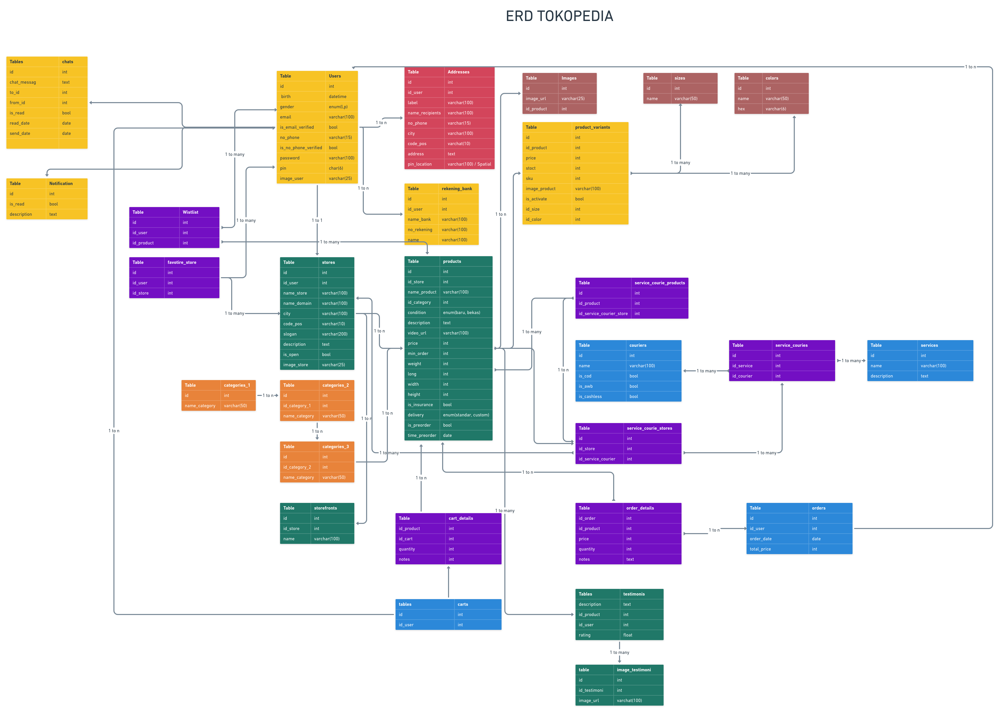

<h1 style="text-align: center;">Struktur DB Tokopedia Clone Sederhana</h1>

## Tentang

ERD ini dibuat berdasarkan pengamatan yang dilakukan pada aplikasi tokopedia. Memang belum sempurna semua struktur databasenya dibuat disini.

Repositori ini berisi sebuah sintaks SQL, yang dapat dijalankan. Ketika dijalankan sintaks SQL tersebut di DBMS MYSQL, program akan membentuk struktur table seperti gambar ERD dibawah

## Gambar ERD Tokopedia Clone

## Controbutor

- :blush: [Wahyu Nur Fadillah](https://github.com/wahyunf354)
